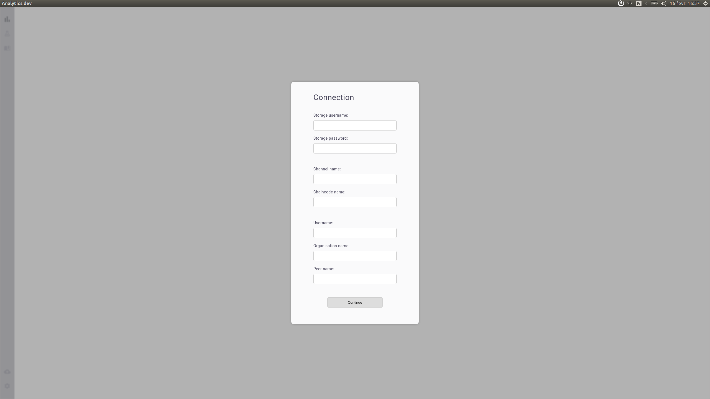

# Analytics &middot; [](https://github.com/MorpheoOrg/morpheo-analytics/blob/master/LICENSE) [](https://www.travis-ci.org/MorpheoOrg/morpheo-analytics)


Analytics 0.0.2 is compatible with the blockchain.

## Installation

To install Analytics you must install yarn 1.4.0 or higher and node 8.4.0 or higher.

You can install the last version of yarn (certainly using sudo privilege):
```
apt-get install yarn
yarn install -g yarn@latest
```

To manage the node version, we recommand to use `n` from https://github.com/tj/n:
```
yarn install -g n
n latest
```

Then, you must install all the packages used by Analytics:
```
yarn install
```

## Launch
To launch Analytics in dev mode as an electron app:
```
yarn run dev
```

## First connection
When you launch for the first time, you will be invited to provide the
connection information:


Please use the form to provide the necessary credentials. If you do not know
how to fill the form, please send a message to the administrator.
