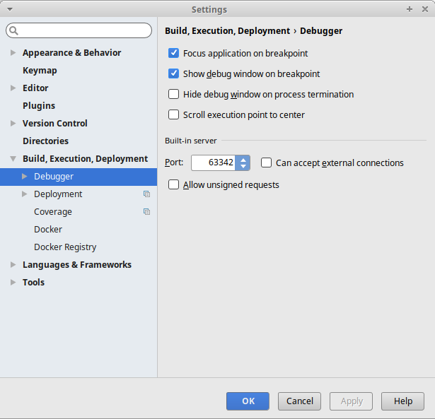
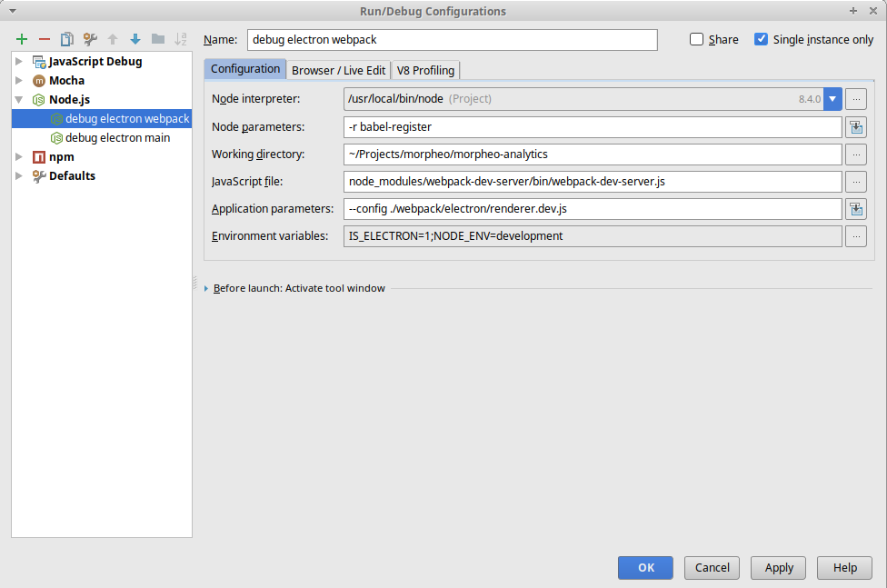
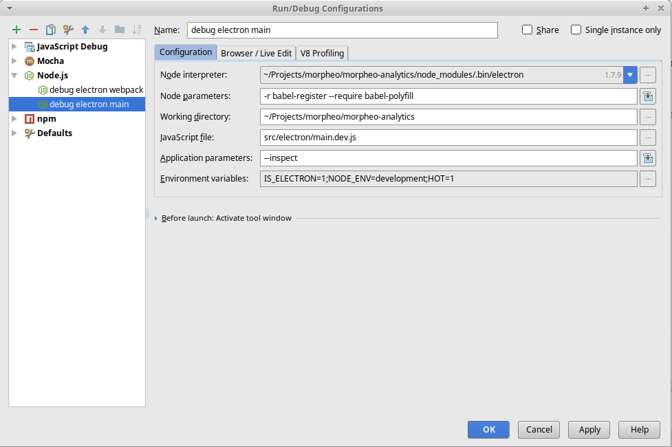

# Analytics &middot; [](https://github.com/MorpheoOrg/morpheo-analytics/blob/master/LICENSE) [](https://www.travis-ci.org/MorpheoOrg/morpheo-analytics)

## Installation

To install Analytics you must install npm 5.5.1 or higher and node 8.4.0 or higher.

You can install the last version of npm (certainly using sudo privilege):
```
apt-get install npm
npm install -g npm@latest
```

To manage the node version, we recommand to use `n` from https://github.com/tj/n:
```
npm install -g n
n latest
```

For installing electron with its correct native modules you need to set some environment variables as described here:
https://electron.atom.io/docs/tutorial/using-native-node-modules/

Update the variables according to your environment:
```shell
# Electron's version.
export npm_config_target=1.7.9
# The architecture of Electron, can be ia32 or x64.
export npm_config_arch=x64
export npm_config_target_arch=x64
# Download headers for Electron.
export npm_config_disturl=https://atom.io/download/electron
# Tell node-pre-gyp that we are building for Electron.
export npm_config_runtime=electron
# Tell node-pre-gyp to build module from source code.
export npm_config_build_from_source=true
```
Then
```shell
npm install
```

Now you're ready to launch the local server which runs on webpack devserver:

```shell
npm run start
```

You can re run `npm run start` now.

The website should be available on `http://localhost:3000/`
If you make any modifications on the rendering code, you'll see your page updating automatically without refreshing thanks to the hot module configuration.

Thanks to BrowserSync, you can also test your website on other devices:
Head to `http://localhost:3002/` for more explanation on how to use BrowserSync.

#### Electron specific

Before running electron app, make sure you've run the docker-compose from the `balance-transfer` project, and created an user (Jim as in the example)

If you want to run the electron version in development mode, run:

```shell
npm run dev
```

It will create a dll folder if needed.
The dll allow us to optimize the way we deal with vendors code in order not to rebuild them every time.
:warning: **<span style="color:red">Be careful: each time you want to add or update a dependency in your package.json, you will have to delete the dll folder for invalidating cache!</span>**


## Configuration

A config directory is present on the root of this project, it will help you configuring multiple environments for dev, prod, debug and staging. 
It is very helpful for managing global variables.
Be aware that `npm run start` uses the `DEVELOPMENT` configuration.

## Build and Deployment

It is possible to build and deploy this project directly from the command line but it is <span style="color:red">strongly not recommended!</span>

You'll have to run:
```shell
npm run build:main
```
It will create the dll directory if it is not present and build the project files.

You can now deploy:
```shell
npm run deploy
```


## Development tools

For developing on this website, I recommend using the excellent IDE  WebStorm, it will allow you to easily debug your code and test it with one mouse click.

One of the first things to do after loading your project in Webstorm is mapping npm scripts.
For this, create new configurations:


Create new npm configurations:


You can now run your dev server with one click by selecting the start option and run it from WebStorm :tada: :tada: :tada:
A lot of scripts are available as you can see. Don't hesitate to add them too.

#### Debug with breakpoints:

Adding breakpoints in the chrome devtools panel is a way to go.
But it's possible to debug with breakpoints inside WebStorm :tada: :tada: :tada:

Launch the `build-debug` utility. This tool will build your project in debug mode and rebuild it when you modify your code after saving it (Ctrl+S).
```shell
npm run build:debug
```
Or you can directly click on one of your predefined mapping :rocket:

Mark your freshly new created build directory as excluded:
- click right on the build directory located on the root of the project
- Select `Mark directory as...`
- Selected `Excluded`

Create a new `Javascript Debug` configuration:


Make sure you correctly filled the fields, especially the `Remote URL`. The port can change, make sure to specify the good one regarding your settings.


Modify the way WebStorm update the project when you modify it:
Open settings (Ctrl+Alt+S), then


You can now launch in debug mode your `Javascript Debug` mapping, set breakpoints and enjoy breakpoint debugging :tada:

:warning: Only drawback: you'll lose the hot module replacement.
So you'll have to reload your `Javascript Debug` configuration after a modification.
It will refresh the website.

### Electron Debug

You can debug your electron app with breakpoint using node configuration in webstorm.
Don't hesitate to create these configurations and set breakpoints.

Launch the webpack rendered in debug mode


Then, launch the main.dev in debug mode


## Test

You can test your project with:
```shell
npm run test
```

And you can also create a mocha configuration if you want to be specific and use breakpoints in your tests:


## Linter   

A `.eslintrc` file is present in the root of the project.
You'll find our Rythm configuration wich extends from the airbnb configuration.

Test the linting of your code:
```shell
npm run eslint
```

### Commit

When you'll commit your changes, a test suite and a eslint commands will be executed thanks to pre-commit.
It ensures the code commited to our repositories does not comport inconsistencies.

